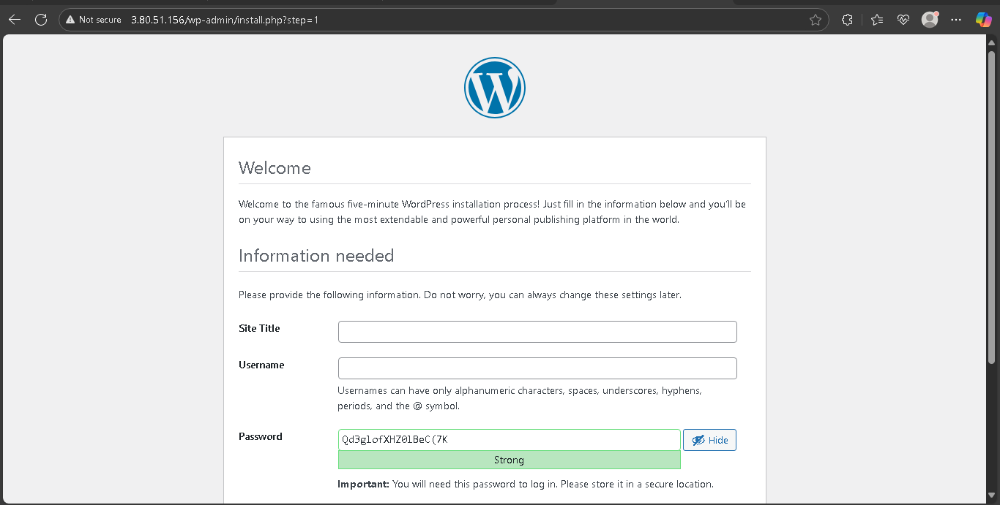
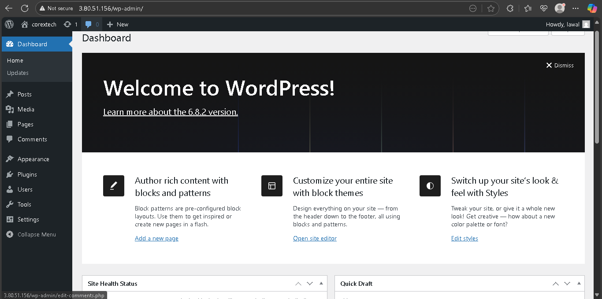

# 🚀 High-Availability WordPress Hosting on AWS  
### LAMP Stack with EBS-Backed MariaDB & Automated Daily Backups  

> **Author:** Lawal Oluwabusayo
> **CorexTech Internship – July 2025**  

---

## 📖 Table of Contents  

1. [Project Overview](#project-overview)  
2. [Architecture Diagram](#architecture-diagram)  
3. [Repository Structure](#repository-structure)  
4. [Prerequisites](#prerequisites)  
5. [Quick Start](#quick-start)  
6. [Detailed Installation](#detailed-installation)  
   - [1. Launch EC2 Instances](#1-launch-ec2-instances)  
   - [2. Attach & Mount EBS Volumes](#2-attach--mount-ebs-volumes)  
   - [3. Secure & Configure MariaDB](#3-secure--configure-mariadb)  
   - [4. Deploy WordPress on App-Server](#4-deploy-wordpress-on-app-server)  
   - [5. Set Up Daily Backups via Cron](#5-set-up-daily-backups-via-cron)  
7. [Scripts & Automation](#scripts--automation)  
8. [Screenshots](#screenshots)  
9. [What I Learned](#what-i-learned)  


---

## 🔍 Project Overview  

This repository demonstrates how to deploy a production-grade WordPress site on AWS using:  
- **Amazon Linux 2** for the App-server (Apache + PHP + WordPress)  
- **Amazon Linux 2023** for the DB-server (MariaDB 10.5)  
- **Amazon EBS** volumes for persistent database storage and a separate backup disk  
- **Cron** to automate nightly database dumps  

**Access your site at:** `http://3.80.51.156/`  
**DB Private IP:** `172.31.26.108`  

---

## 🗺️ Architecture Diagram  

  
*Shows public App-server, private DB-server, EBS volumes, and cron backup flow.*  

---

## 📂 Repository Structure  

lamp-wordpress-ebs-backup/
├── LICENSE
├── README.md
├── scripts/
│ ├── user_data_app.sh
│ ├── user_data_db.sh
│ └── backup_wp_db.sh
├── docs/
│ ├── architecture.md
│ └── installation.md
├── diagrams/
│ └── network-architecture.png
└── screenshots/
├── 01-ec2-launch.png
├── 02-ebs-attached.png
├── 03-ebs-mounted.png
├── 04-wordpress-install.png
└── 05-cron-backup-success.png

yaml
Copy
Edit

---

## ⚙️ Prerequisites  

- AWS account with EC2 and EBS permissions  
- Key pair (.pem) for SSH access  
- VPC & Security Groups configured:  
  - App-server SG: allow TCP 22 (SSH) from your IP, TCP 80 (HTTP) from anywhere  
  - DB-server SG: allow TCP 22 (SSH) from App-server private IP only  

---

## 🚀 Quick Start  

1. **Clone repository**  
   ```bash
   git clone https://github.com/yourusername/lamp-wordpress-ebs-backup.git
   cd lamp-wordpress-ebs-backup
   ```
2. **Launch EC2 instances with the provided user-data scripts**
3. **Attach and mount two EBS volumes to the DB-server**
4. **Verify WordPress at [http://3.80.51.156/](http://3.80.51.156/)**
5. **Confirm daily backups appear in `/mnt/dbbackup`**

## 🛠️ Detailed Installation

### 1. Launch EC2 Instances

#### App-server (Amazon Linux 2)
- Paste `scripts/user_data_app.sh` into User Data
- Security Group: allow SSH (22) & HTTP (80)

#### DB-server (Amazon Linux 2023)
- Paste `scripts/user_data_db.sh` into User Data
- Security Group: allow SSH (22) only from App-server private IP

<details>
<summary>Show user-data samples</summary>

**user_data_app.sh**
``` bash
#!/bin/bash
# …enables root login…

yum update -y
yum install -y httpd php php-mysqlnd wget
systemctl enable --now httpd
```
# …download & configure WordPress…
user_data_db.sh

``` bash
#!/bin/bash
# …enables root login…
dnf update -y
dnf install -y mariadb105-server
systemctl enable --now mariadb
# …secure MariaDB, create DB & user, format & mount /dev/sdb & /dev/sdc…
```
</details> ```

## 2. Attach & Mount EBS Volumes

### In AWS Console → Volumes → Create Volume
- **Volume 1**: 10 GiB → attach as `/dev/sdb`
- **Volume 2**: 5 GiB → attach as `/dev/sdc`

### On DB-server, verify and mount:
```bash
lsblk                       # see /dev/sdb, /dev/sdc
mkfs.ext4 /dev/sdb
mkdir -p /mnt/dbdisk
mount /dev/sdb /mnt/dbdisk
echo '/dev/sdb /mnt/dbdisk ext4 defaults,nofail 0 2' >> /etc/fstab

mkfs.ext4 /dev/sdc
mkdir -p /mnt/dbbackup
mount /dev/sdc /mnt/dbbackup
echo '/dev/sdc /mnt/dbbackup ext4 defaults,nofail 0 2' >> /etc/fstab
``` 


## 3. Secure & Configure MariaDB
If not fully scripted, run:

```bash
mysql_secure_installation
# Set strong root password
# Remove anonymous users
# Drop test database
# Reload privileges
```

Test connection from App-server:

```bash
mysql -h 172.31.26.108 -u user_lawal -pYourDBUserPassword WP-DATABASE
```

## 4. Deploy WordPress on App-Server

### SSH into App-server:
```bash
ssh root@3.80.51.156
```
## Ensure /var/www/html/wp-config.php is updated:
```php
define('DB_HOST', '172.31.26.108');
define('DB_NAME', 'WP-DATABASE');
define('DB_USER', 'user_lawal');
define('DB_PASSWORD', 'YourDBUserPassword');
```
## Restart Apache if needed:
```bash
systemctl restart httpd
```
Point browser to http://3.80.51.156/ and complete the WordPress setup wizard.

Screenshot Reference:


## 5 Set Up Daily Backups via Cron

### Install and enable cron:
```bash
sudo dnf install -y cronie
sudo systemctl enable --now crond
```
 Place your backup script:
```bash
sudo cp scripts/backup_wp_db.sh /usr/local/bin/
sudo chmod +x /usr/local/bin/backup_wp_db.sh
```
Edit root's crontab:
```bash
sudo crontab -e
```

Add the following line to the crontab:

```cron
0 2 * * * /usr/local/bin/backup_wp_db.sh >> /var/log/wp_db_backup.log 2>&1
```


## 📜 Scripts & Automation
scripts/user_data_app.sh – Bootstraps App-server

scripts/user_data_db.sh – Bootstraps DB-server + EBS mount

scripts/backup_wp_db.sh – Dumps WP-DATABASE nightly to /mnt/dbbackup

## 📸 Screenshots

| Step | File |
|------|------|
| EC2 Instances Launched |  |
| EBS Volumes Attached |  |
| EBS Volumes Mounted |  |
| WordPress Installation |  |
| Cron Backup Success |  |

## 🎓 What I Learned
- EC2 user-data automation
- Amazon Linux 2023 MariaDB installation via DNF
- Formatting & mounting EBS for data persistence
- Securing and configuring MariaDB remotely
- Automating backups with cron
- Structuring a professional GitHub project for DevOps